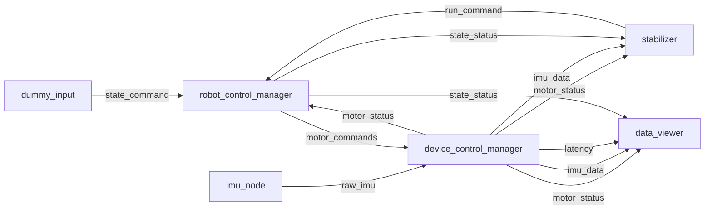
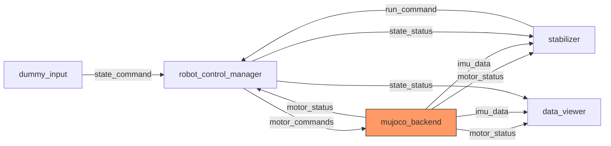

# アーキテクチャ概要

## Dataflow 構成

本プロジェクトは [dora-rs](https://dora-rs.ai/) を使ったノードグラフ構成です。
用途ごとに 4 つの dataflow を用意しています。

| dataflow | 用途 | 通信側 | 制御側 |
|----------|------|--------|--------|
| `dataflow.yaml` | 実機運用 | `device_control_manager` (C++) | `stabilizer` (C++) |
| `dataflow_sim.yaml` | シミュレーション | `mujoco_backend` (Python) | `stabilizer` (C++) |
| `dataflow_sysid.yaml` | 実機 SysID | `device_control_manager` (C++) | `sysid_controller` (Python) |
| `dataflow_sim_sysid.yaml` | sim SysID | `mujoco_backend` (Python) | `sysid_controller` (Python) |

## ノード接続図（実機）

**実機構成** (`dataflow.yaml`)


**シミュレーション構成** (`dataflow_sim.yaml`) — device_control_manager + imu_node を mujoco_backend に差し替え


## エントリーポイント

### 1. 通信側（MotorDriver）

`device_control_manager` は `MotorDriver` インターフェースを通じてモーターと通信します。
CAN、moteus プロトコルの知識は `MoteusCanDriver` に閉じ込められています。

```
src/cpp/interface/motor_driver.hpp   ← 抽象インターフェース
src/cpp/driver/moteus_can_driver.*   ← CAN-FD + moteus（実機）
src/cpp/driver/dummy_driver.*        ← テスト用ダミー
```

#### MotorDriver インターフェース

```cpp
class MotorDriver {
public:
    virtual bool Open(const std::string& device) = 0;
    virtual void Close() = 0;
    virtual void SendCommands(const std::vector<AxisRef>& commands,
                              const std::vector<AxisConfig>& axes) = 0;
    virtual void SendQueries(const std::vector<AxisConfig>& axes) = 0;
    virtual std::vector<AxisAct> ReceiveStatus(
                              const std::vector<AxisConfig>& axes,
                              int timeout_ms) = 0;
    virtual void SendAllOff(const std::vector<AxisConfig>& axes) = 0;
};
```

**新しい通信バス（例: RS485）を追加する場合:**
1. `MotorDriver` を継承した新クラスを作成（例: `MoteusRs485Driver`）
2. `device_control_manager/main.cpp` の `CreateDriver()` に分岐を追加
3. `robot_config` の `transport` フィールドで選択

#### Python バックエンド（MuJoCo 等）で差し替える場合

MotorDriver ではなく **dora ノードごと差し替え** ます。
以下の入出力を満たせば `dataflow_sim.yaml` で接続できます。

| 方向 | 名前 | 型 | 説明 |
|------|------|----|------|
| 入力 | `tick` | dora timer (3ms) | 制御周期トリガー |
| 入力 | `motor_commands` | `AxisRef[]` (56 bytes × N) | モーターコマンド |
| 出力 | `motor_status` | `AxisAct[]` (32 bytes × N) | モーター状態 |
| 出力 | `imu_data` | `ImuData` (112 bytes) | IMU センサーデータ |

### 2. 制御側（Controller）

`stabilizer` ノードは `Controller` インターフェースで制御アルゴリズムを切り替えます。

```
src/cpp/node/stabilizer/controller.hpp              ← 抽象インターフェース
src/cpp/node/stabilizer/angle_pid_controller.*       ← 倒立振子 PID
```

#### Controller インターフェース

```cpp
class Controller {
public:
    virtual void Reset() = 0;
    virtual void Update(const std::vector<AxisAct>& motor_status,
                        const ImuData& imu_data) = 0;
    virtual std::vector<AxisRef> Compute(const RobotConfig& config) = 0;
};
```

`robot_config` の `controller` フィールドで選択されます（デフォルト: `"angle_pid"`）。

**Python で制御アルゴリズムを差し替える場合:**
`stabilizer` ノードごと差し替えます（`sysid_controller` と同様）。
以下の入出力を満たしてください。

| 方向 | 名前 | 型 | 説明 |
|------|------|----|------|
| 入力 | `motor_status` | `AxisAct[]` (32 bytes × N) | モーター状態 |
| 入力 | `imu_data` | `ImuData` (112 bytes) | IMU データ |
| 入力 | `state_status` | `State` (1 byte) | ロボット状態 |
| 出力 | `run_command` | `AxisRef[]` (56 bytes × N) | 制御コマンド |

## データ構造体

### AxisRef（コマンド）

```cpp
struct AxisRef {            // 56 bytes
    MotorState motor_state; // uint8_t + 7 bytes padding
    double ref_val;         // 目標値: position (rad) or velocity (rad/s)
    double kp_scale;        // 位置ゲインスケール
    double kv_scale;        // 速度ゲインスケール
    double velocity_limit;  // rad/s
    double accel_limit;     // rad/s²
    double torque_limit;    // Nm
};
```

### AxisAct（フィードバック）

```cpp
struct AxisAct {            // 32 bytes
    double position;        // rad
    double velocity;        // rad/s
    double torque;          // Nm
    uint8_t fault;          // 0 = 正常
};
```

### ImuData（IMU センサー）

```cpp
struct ImuData {            // 112 bytes
    double timestamp;       // seconds
    double ax, ay, az;      // 加速度 m/s²
    double gx, gy, gz;      // 角速度 rad/s
    double q0, q1, q2, q3;  // クォータニオン (w, x, y, z)
    double roll, pitch, yaw; // オイラー角 rad
};
```

### MotorState（制御モード）

```cpp
enum class MotorState : uint8_t {
    OFF = 0,            // サーボ無効
    STOP = 1,           // 現在位置保持
    POSITION = 2,       // 位置制御
    VELOCITY = 3,       // 速度制御
    TORQUE = 4,         // トルク制御
    SET_POSITION = 5    // エンコーダリセット
};
```

### State（ロボット状態マシン）

```cpp
enum class State : uint8_t {
    OFF = 0,    // サーボ OFF
    STOP = 1,   // 停止・位置保持
    READY = 2,  // 初期姿勢移行
    RUN = 3     // 制御実行中
};
```

## Python でのバイナリフォーマット

```python
AXIS_REF_FMT  = "<B7xdddddd"   # 56 bytes
AXIS_ACT_FMT  = "<dddB7x"      # 32 bytes
IMU_DATA_FMT  = "<14d"          # 112 bytes
```

dora の `node.send_output()` で `pa.array(list(bytes), type=pa.uint8())` として送信します。
